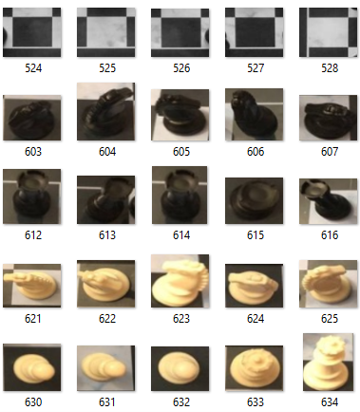
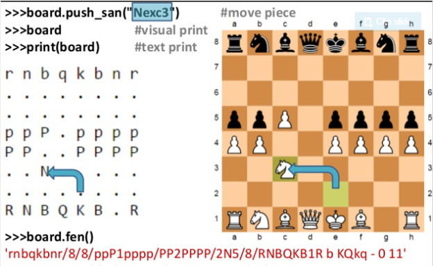
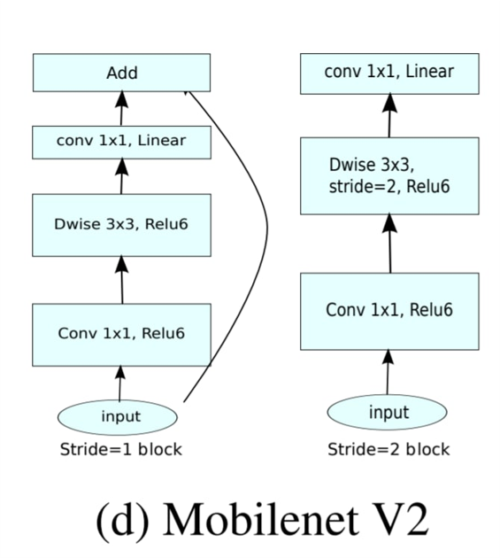

# ARchess

<h2>Board detection <h2>

src: [chessboard detection](https://github.com/Elucidation/ChessboardDetect/blob/master/FindChessboards.ipynb)

<h2>Cutting out positions<h2>
  

<h2>Finding chess pieces (BAD) <h2>
  
  We have trained mobilenet v2 model to classify pictures of squares having 13 classes in total. We have trained the model on our own dataset and scored 82% accuracy. For better performance, we encorage you to try to use this [dataset](https://www.kaggle.com/tannergi/chess-piece-detection) from kaggle. It lacks empty squares in it and our crop.py can get them for you to add. 

