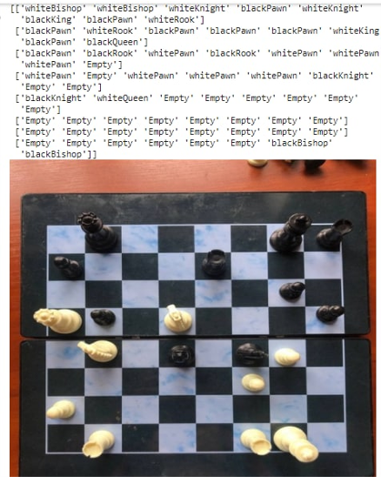

# ARchess

## Board detection 

Classic task in computer vision. Code souces below.

src: [chessboard detection](https://github.com/Elucidation/ChessboardDetect/blob/master/FindChessboards.ipynb)

## Cutting out positions
  
  Our script (crop.py) does that.
  

## Finding chess pieces (BAD) 
  
  We used mobilenet v2 model to classify pictures of squares having 13 classes in total. We trained the model on our own dataset and scored 82% accuracy. 
  
  For better performance, we encorage you to try to use this [dataset](https://www.kaggle.com/tannergi/chess-piece-detection) from kaggle. It lacks empty squares in it and our crop.py can get them for you to add. 

## Turn recommendation

  We used minimax algorithm to provide user with recommendation to the user of where to move pieces. This can be used as a cheat or to help learn the game. The algorithm analyses all possible events 4 turns in advance and picks the most value turns. It is somewhat limited in terms of understanding the game, but works most of the times.
  

## Magnificent visualisations
  Our goal was to visualise the best move predicted by our recommendation algorithm. (powered by sciimage).

## Credits
Me

[Rodion Bukhanevich](https://github.com/Rodionbukhanevych11)

[Olha Revenko](https://github.com/OlhaRevenko)

[Maksym](https://github.com/Greazy)

